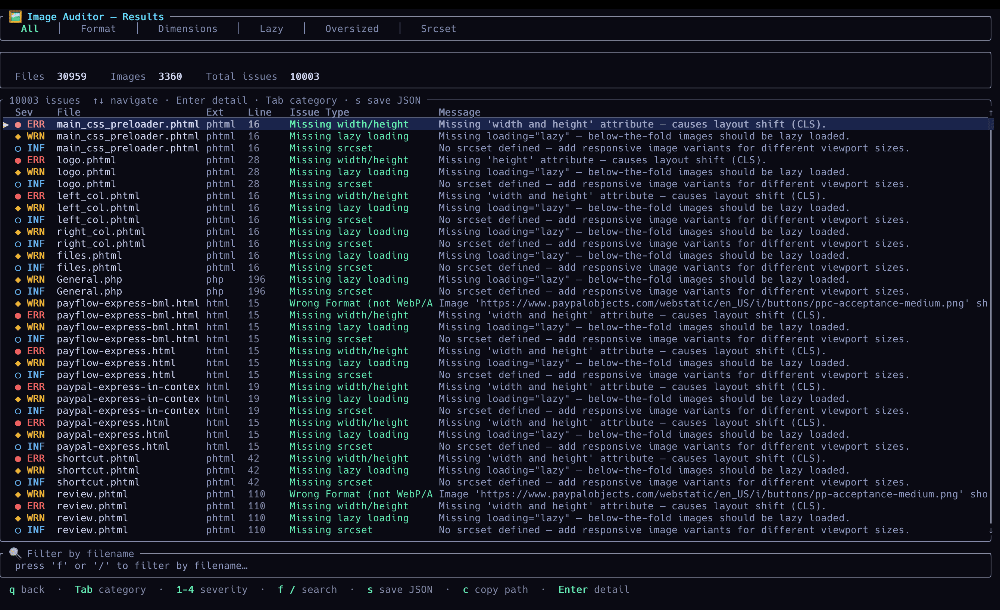

# 🖼 Image Auditor

> **Scan your entire codebase for image performance issues. Fix them with AI. In seconds.**

Image Auditor is a **Rust-powered terminal tool** that finds every image
tag hurting your **Lighthouse score, Core Web Vitals, and SEO** — across
all your HTML, templates, and JS frameworks — then lets your LLM fix them
in one keypress.

Just run it against your repo and see exactly what's broken.

---

## ⚡ What it does
```bash
image-auditor ./my-project
```

Scans thousands of files in seconds, shows every broken `` tag with
severity, file, and line number — and optionally patches the code for you
using OpenAI, Anthropic, or a local Ollama model.


---

## 🔎 Issues detected

| Issue | Impact | Severity |
|---|---|---|
| PNG/JPG instead of WebP/AVIF | Larger payload, slower LCP | ⚠ Warning |
| Missing `width` / `height` | Layout shift, high CLS score | ✖ Error |
| Missing `loading="lazy"` | Wasted bandwidth, slower TTI | ⚠ Warning |
| Oversized image file (>200 KiB) | Slower LCP, higher bounce rate | ✖ Error |
| Missing `srcset` | Serving 2× pixels on mobile | ℹ Info |
| JSX `<Image>` missing `alt` | Accessibility & SEO penalty | ⚠ Warning |

---

## ✨ Key features

- **Instant results** — Rust scanner, handles large monorepos without breaking a sweat
- **Full TUI** — keyboard-driven interface, filter by severity or issue type, search by filename
- **AI-powered fixes** — press `a` on any issue, review the diff, apply with `y`
- **Safe patching** — shows a before/after diff preview before touching any file
- **Multi-framework** — HTML, PHP, Vue, Svelte, JSX/TSX, Handlebars, Nunjucks, EJS and more
- **JSON export** — pipe results into your own reports or CI checks
- **Works offline** — AI features are optional; the scanner needs nothing but the binary

---

## 📁 Supported file types

`html` `phtml` `htm` `jsx` `tsx` `js` `ts` `vue` `svelte` `hbs` `ejs` `njk` `php`

Auto-skips: `node_modules` `.git` `dist` `build` `.next`

## 🎬 Video Demo


# ⚡ Install

```bash
cargo install --path .
```

### macOS
```bash
# Install
brew tap 0franco/ai-image-auditor
brew install image-auditor

# Upgrade
brew update
brew upgrade image-auditor
```

# 🧪 Usage

```bash
# Launch interactive TUI (menu to pick path)
image-auditor

# Scan a specific directory directly
image-auditor ./my-project
image-auditor /var/www/html
```

**AI fixes are optional.** The scanner works with no configuration.
To enable them, create a `.env` file in the directory where you run the tool

## 🖥 TUI Controls

| Key | Action |
|---|---|
| `Enter` | Edit path / confirm / view detail |
| `↑ ↓` or `j k` | Navigate |
| `Tab / Shift+Tab` | Filter by issue category |
| `1` | Show all severities |
| `2` | Errors only |
| `3` | Warnings only |
| `4` | Info only |
| `s` | Save report to `image-audit-report.json` |
| `c` | Copy current row file path to clipboard |
| `q / Esc` | Back / quit |
| `a` (Detail view) | Ask AI for an automatic code fix suggestion |
| `p` (Detail view) | Preview & apply the AI‑proposed patch (with confirmation) |

## 🤖 AI-powered fixes

Press **`a`** on any issue and your configured LLM (OpenAI, Anthropic, or
local Ollama) will read the exact file context, diagnose the problem, and
propose a minimal code patch — touching only the attributes that are
actually missing.
```
Issue: Missing height attribute — causes layout shift (CLS)

  Before  │  
  After   │  
```

**The workflow is non-destructive by design:**

1. **`a`** — ask the LLM (confirmation prompt guards against accidental token spend)
2. **`p`** — review the full before/after diff before anything is written
3. **`y`** — apply, or **`n` / `Esc`** to cancel
4. The file is patched in-place and the scan **reruns automatically** — fixed issues disappear from the list immediately

**Supported providers** — set `ACTIVE_LLM_PROVIDER` in your `.env`:

| Provider | Variable | Default model       |
|---|---|---------------------|
| OpenAI | `OPENAI_API_KEY` | `gpt-5.2`           |
| Anthropic | `ANTHROPIC_API_KEY` | `claude-sonnet-4-6` |
| Ollama (local) | — | `qwen3-coder:30b`   |

**Skip the confirmation prompt** when iterating quickly:
```env
LLM_SKIP_CONFIRM=1
```

**Enable verbose mode** to get a full explanation alongside the patch:
```env
AI_VERBOSE=1
```

### 🔧 Configuring the AI engine

The AI helper is **fully optional** and controlled through environment variables.
Use the provided `.env.example` as a starting point:

```bash
cp .env.example .env
```

Then edit `.env` and pick your provider:

```bash
# Possible values: openai, anthropic, ollama
ACTIVE_LLM_PROVIDER=openai
OPENAI_API_KEY=sk-...

# Optional: skip confirmation prompt in the TUI
LLM_SKIP_CONFIRM=true
```

#### OpenAI

```bash
OPENAI_API_KEY=your-openai-api-key
# Optional:
# OPENAI_BASE_URL=https://api.openai.com
# OPENAI_MODEL=gpt-5.2
```

#### Anthropic

```bash
ANTHROPIC_API_KEY=your-anthropic-api-key
# Optional:
# ANTHROPIC_BASE_URL=https://api.anthropic.com
# ANTHROPIC_MODEL=claude-sonnet-4-6
```

#### Ollama (local)

```bash
ACTIVE_LLM_PROVIDER=ollama
OLLAMA_BASE_URL=http://localhost:11434
OLLAMA_MODEL=qwen3-coder:30b
```

Once your environment is set, launch `image-auditor`, open an issue detail, and hit **`a`** to let the AI propose a fix — then **`p` → `y`** to apply it in seconds.

## 🏗 Build

```bash
cargo build --release
./target/release/image-auditor
```

## Star History

<a href="https://www.star-history.com/?repos=0franco%2Fimage-auditor&type=date&legend=top-left">
 <picture>
   <source media="(prefers-color-scheme: dark)" srcset="https://api.star-history.com/image?repos=0franco/image-auditor&type=date&theme=dark&legend=top-left" />
   <source media="(prefers-color-scheme: light)" srcset="https://api.star-history.com/image?repos=0franco/image-auditor&type=date&legend=top-left" />
   
 </picture>
</a>

## 🤝 Contributing

Contribute! Please open an issue or submit a pull request.

<a href="https://www.buymeacoffee.com/travelingcode" target="_blank">
  
</a>